# FinTech Project 3: STAGE

## Statistical Arbitrage: Mean Reversion Analyses in the Crypto Market
*A Python-powered quantitative, analytical approach to pairs trading on the Crypto Market by Juan Cajigas, Francisco Lopez, Daniel Klein Velderman and Steffen Westerburger*

## Introduction

This project focuses on the concept of statistical arbitrage on the Crypto Currency market. As the conceptual basis of this project we used the research paper ['Statistical Arbitrage in the U.S. Equities Market'](https://www.math.nyu.edu/faculty/avellane/AvellanedaLeeStatArb071008.pdf) (Avellenda, Lee 2008).

Statistical arbitrage is a trading strategy which utilizes mean reversion to invest in diverse pairs and/or portfolios. It does so by investing and divesting in these pairs for very short periods of time/high frequency trading (from only seconds up to a couple of days). In doing so it heavily relies on market prices to return to a historical or predicted normal which is called the mean reversion (Investopedia)

Statistical arbitrage strategies are market neutral. This is the case because for each position that is taken, a long position and short position is taken. In doing so the aim is to profit from inefficient pricing differences in correlated securities. One could for example think of an analysis between American Airlines and Delta Airlines. If data shows American Airlines is undervalued and Delta is overvalued - you would subsequently open a long position in American Airlines and a short position in Delta Airlines. 

We developed an algorithm using Python to help us trade on potentially correlated pairs of crypto currencies. This algorithm allows us to trade correlated currencies on inefficient pricing differences for which the user can determine the conditions (in terms of standard deviations from the mean).

## Data

In this project we build on two main data sources. We use the [Binance](www.binance.com) exchange API integration for Python to pull in realtime time minute to minute price information on the crypto currencies of choice. Binance is a well known name in the industry and operates as the worlds biggest bitcoin exchange and altcoin crypto exchange in the world by volume. To use the Binance integration with Python, one needs to sign up to receive API-keys as well as install the Binance library by using  **pip install python-binance**.

The second source we use is [Kucoin](www.kucoin.com) which is a Bitcoin exchange that provides users with a unique sandbox environment to test their trading strategies. Using Kucoin we were able to place automated fictional trades with our Pythin algorithm based on real time price information we pulled in from Binance. To use Kucoin one needs to sign up for the Sandbox environment and install the Kucoin library by using **pip install python-kucoin**.

## Our Algorithm

Step 1: Establish a linear relationship between the return of the two cryptocurrencies:

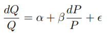

Step 2: Estimate the parameters in the linear regression and save the vector of residuals (epsilon)
Expressing the residuals as a function of the two cryptocurrencies, and redefining them as Xt (to emphasize time dependence) we have the following:

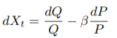

The main hypothesis in Statistical Arbitrage is that the vector Xt is mean reverting. Mathematically we can define a mean-reverting process as a Ornstein-Uhlenbeck (OU) stochastic differential equation:

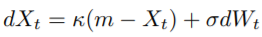

The meaning of the parameters in the OU process is this:

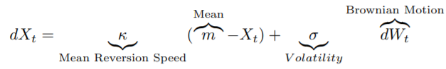

Step 3: We have discrete-time data. In order to estimate the parameters in the OU process we can approximate it to an Autoregressive process or order one AR(1):

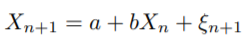

Step 4: The relationships between the parameters in the AR(1) process and the parameters that we need in the OU process are the following:

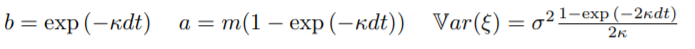

Step 5: We can then generate a trading signal that indicates the number of units of mismatch in terms of the volatility of the OU process:

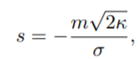

## Trading with the Algorithm: Binance and Kucoin

As aforementioned, we use both Binance and Kucoin in this project to trade based on our developed algorithm. Kucoin provides a free sandbox environment to this end. 

## Backtesting

In order to test whether our algorithm is a could potentially provide us with valuable/profitable trading insights, it is important to properly backtest our algorithm by testing it with historical data. In doing so we can determine the performance of our algorithm, as well as determine under what conditions it performs best (for example in terms of number of standard deviations from the mean between to correlated stocks).

We backtested our algorithm using historical data of the correlation between LTCUSDT (dependent variable) and EOSUSDT (independent variable). We tested out code's performance with two different standard deviation levels: 1 and 2.

The results were mixed:

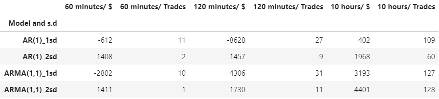

In monetary terms the strategy produced, overall, negative results. Investing $1M each time a signal was "on" produced a maximum profit of $4,306 (ARMA(1,1)_1sd with 120 minutes). The maximum loss was $8,628 when the AR(1)_1sd model was used on 120 minutes. We also found a very even number of winning and losing strategies for each model. It seems that for this specific set of data and discrete-time models used  (AR(1) and ARMA(1,1)) the strategy is not adding value.

## Creating our own TOKEN

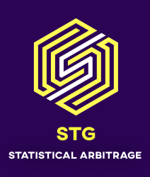

- We minted the STG token based on our strategy. We used the ERC20 standard so that it can be transferred and traded on exchanges.
- When buying our token, you will be following out trading strategy in a simple way.

  
   
 

 #|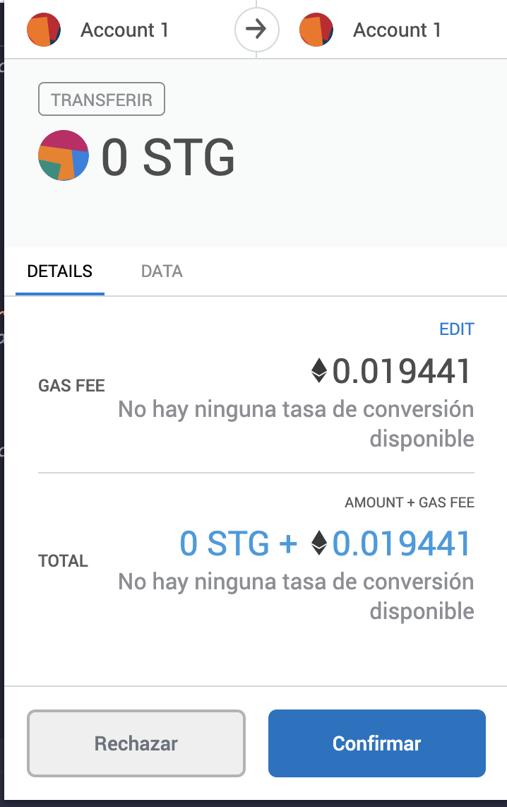

## Post-Mortem

This project provided us with a unique opportunity to explore several trade strategies focusing on statistical arbitrage. Statistical arbitrage is a very theoretical and complicated subject which heavily relies on being able to engage in well informed high-frequency trading.

For pratical reasons we used two different exchanges for pulling in price information and making the actual trades. In any real world trading situation this would not be a clever strategy since even the tiniest of discrepencies between exchanges potentially have great impact on the success or failure of these strategies. 

Also, in this project we focused on the trading of just one pair of potentiallt correlated crypto currencies. In a real world situation statistical arbitrage usually involves diverse portfolios of up to thousands of securities. 

We would like to build our STG ERC20 as a TokenSet under the Set Protocol, which allows users to buy and sell tokenized portfolio management strategies easily. 
Each Set is a smart basket ERC20 token of crypto assets that automatically rebalances based on the strategy you choose.  

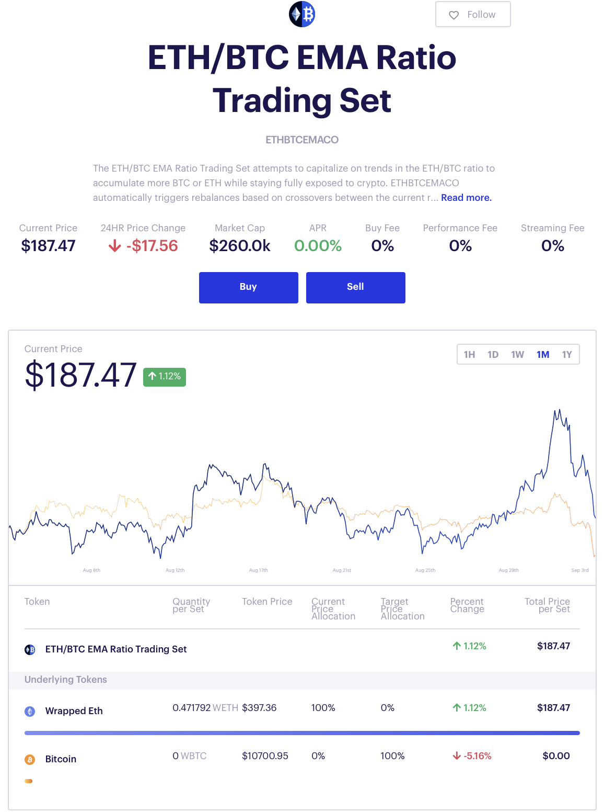

